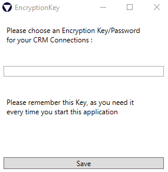
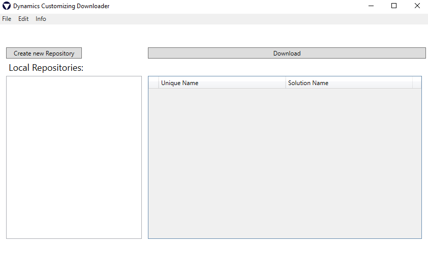
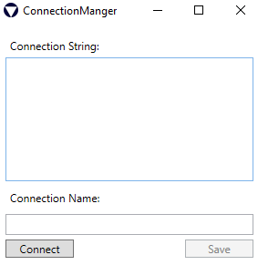
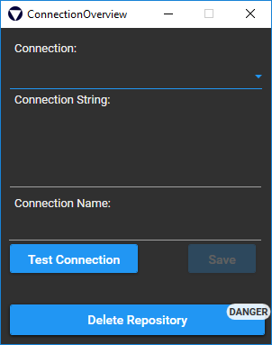

# Dynamics365-Customizing-Downloader
Build Status:

A simple WPF Application Which Downloads and Extracts Dynamics365 (properly also Xrm2016 or earlier, but it is not tested) Customizing Solutions.
The whole Application is built around the XRM SDK and the Solution Packager.

See more https://msdn.microsoft.com/en-us/library/jj602987.aspx

## Basic Usage

##### CRM Connection:

- Open the App and choose a Password which is used for encrypting your Connection String.

- After you entered a Password you should see the MainWindow of the Application

- Press the Create new Repository Button to create a new Connection.

- Add your Connection string (See https://msdn.microsoft.com/en-us/library/mt608573.aspx, or Wiki Pages) and press the "Connect" Button

- Rename the Connection if you want to and press "Save"

##### Download Solutions

- Back in the Main Dialog, choose your newly created Connection

- After a short loading time you should see all your Solutions (only managed) within the chosen CRM Organization

- Select those you want to Download and press "Download"

- Within the Download Dialog, choose a local Folder and click "Download".

#### Possible Data loss! Every Folder/File within your chosen Folder which will collide with the Solution Names will be deleted. To avoid any issues, choose an empty Folder for the extraction.

-> Your Solutions should be Downloaded and Extracted now, any Error will be reported within the Status Textbox.

## Update CRM Connection

- Within the Main Form, choose File -> Open Connection Overview

- In the following Dialog, select the Conenction you want to Update in the DropDown Menu

- After Updated the Connection press "Test Connection", this may take some secounds while the connection is validated

- If the Connection was successfully tested, the save Button will be enabled.
